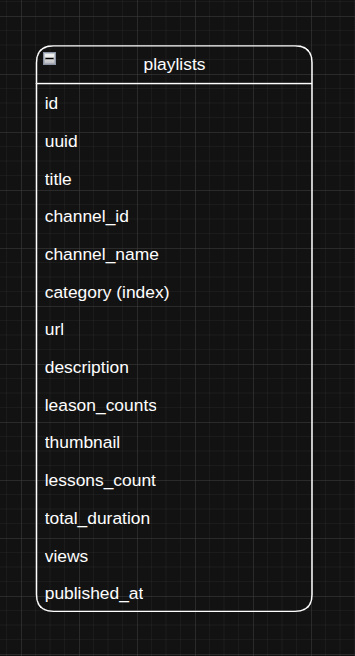

# Database Entity Relationship Diagram

Visual representation of the YouTube scrapper database schema and relationships.

---

## 📊 ERD Overview

The Entity Relationship Diagram (ERD) provides a visual blueprint of the database structure, showing all tables, relationships, and constraints in the YouTube playlist scrapper system.

### Image Reference
- **File**: `img.png`
- **Format**: PNG
- **Tool**: Draw.io (`erd.drawio`)
- **Last Updated**: April 5, 2024

### Database ERD

---

## 📺 Playlists Table Schema

### Required Fields
- `id` — Primary key
- `uuid` — YouTube playlist ID (unique)
- `title` — YouTube playlist title
- `channel_id` — YouTube channel identifier
- `channel_name` — Channel display name
- `category` — Playlist category (indexed)
- `url` — YouTube playlist URL
- `created_at` — Creation timestamp (indexed)
- `updated_at` — Last update timestamp

### Optional Fields
- `description` — Playlist description (longText)
- `thumbnail` — Playlist thumbnail URL
- `lessons_count` — Number of videos in playlist
- `total_duration` — Total duration of all videos
- `views` — Total view count
- `published_at` — YouTube publish date

---

## 🚀 Performance Considerations

### Indexed Columns
- **Primary keys** (all tables)
- `playlists.uuid` — UNIQUE index for YouTube playlist ID lookups
- `playlists.category` — Fast filtering by category
- `playlists.created_at` — Chronological queries and sorting

---

## 🛡️ Constraints & Business Rules

### Database Constraints
- `playlists.uuid` — UNIQUE constraint prevents duplicate YouTube playlists

### Business Logic
- **Playlist Updates**: Background job `UpdatePlaylistDetailsJob` fetches and updates playlist metadata
- **Unique Playlists**: UUID constraint ensures each YouTube playlist is stored once
- **Category Indexing**: Fast category-based filtering and queries
- **Nullable Metadata**: Handles cases where YouTube API doesn't return complete data

---

*This ERD reflects the current database schema as implemented in the migrations. For the most up-to-date structure, refer to the migration files in `database/migrations/`.*
