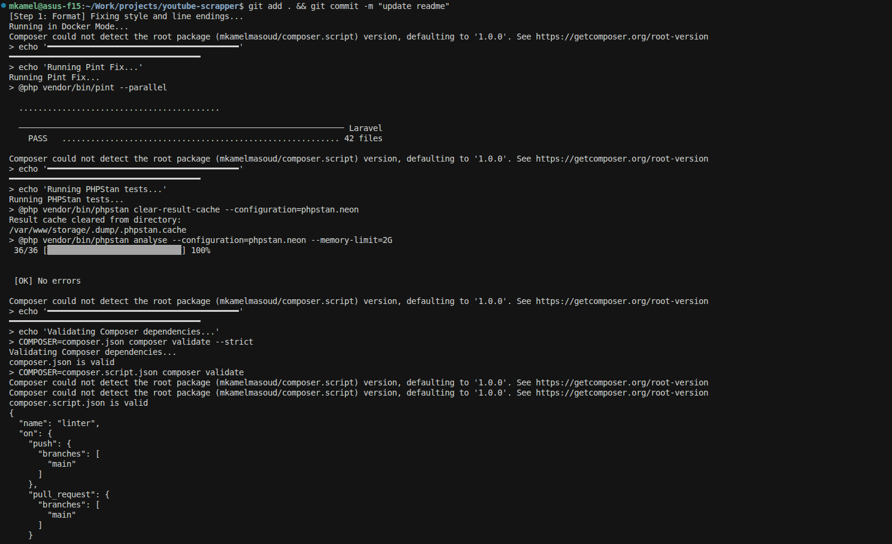
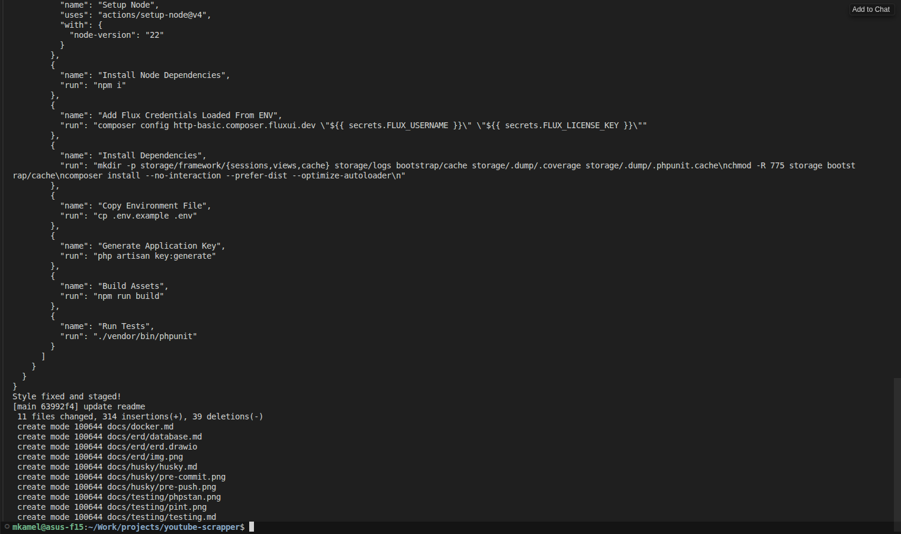
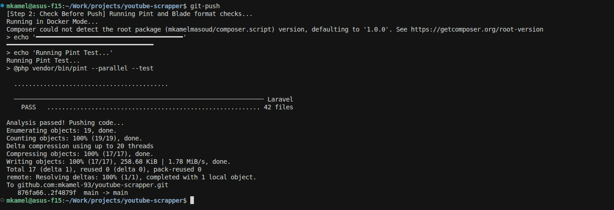

# Husky Git Hooks

Husky runs automated checks on git actions.

### Pre-Commit

--

### Pre-Push

## Mode Detection

Hooks automatically detect whether to run in **Docker Mode** or **Local Mode**:

| Mode | Condition | Behavior |
|------|-----------|----------|
| **Docker** | Docker is installed AND `.docker/docker-compose.yml` exists | Runs all checks inside containers (`php` and `web`) |
| **Local** | Docker not found OR compose file missing | Runs checks directly on host machine |

### Docker Mode

Commands execute inside containers with proper user context:
- PHP commands run as `www-data` in the `php` container
- Node/npm commands run as `nginx` in the `web` container

### Local Mode

Commands run directly on your host machine using local PHP and Node installations.

> **Tip:** If you want to force Local mode temporarily, rename or remove `.docker/docker-compose.yml`.

## Pre-commit

Runs on every commit:

- Fixes code style with Laravel Pint
- Runs PHPStan static analysis
- Validates composer files
- Validates YAML files

## Pre-push

Runs before every push:

- Runs Pint checks (fails if style issues)
