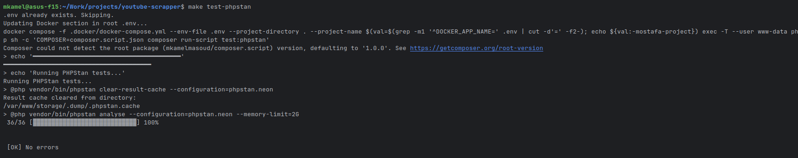
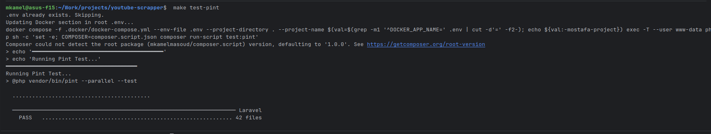

# Testing

Testing and development tools.

---

## 🧪 Test Types

| Type | Tool         | Location | Focus             |
|------|--------------|----------|-------------------|
| **Static Analysis** | PHPStan      | Config: `phpstan.neon` | Type safety       |
| **Code Style** | Laravel Pint | Config: `pint.json` | PSR-12 compliance |

---

## 📁 PHPstan

---

---
## 📁 Pint


---

## 🚀 Running Tests

### Docker Mode

Tests run inside the PHP container:
```bash
make test-phpstan
```
```bash
make test-pint
```

